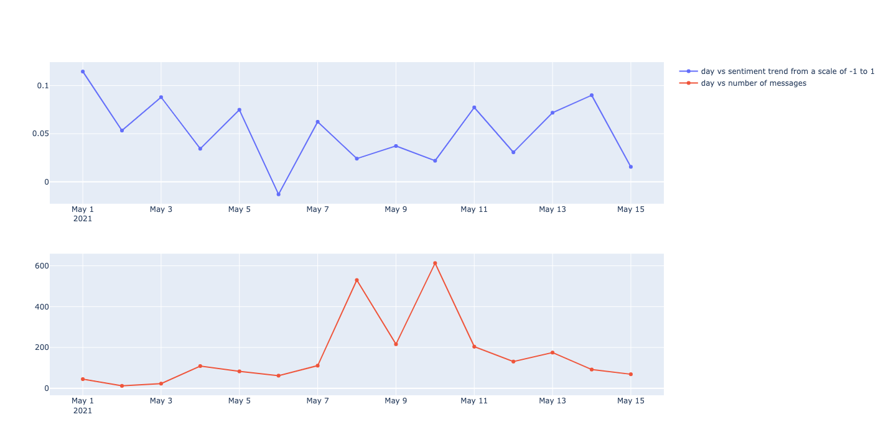
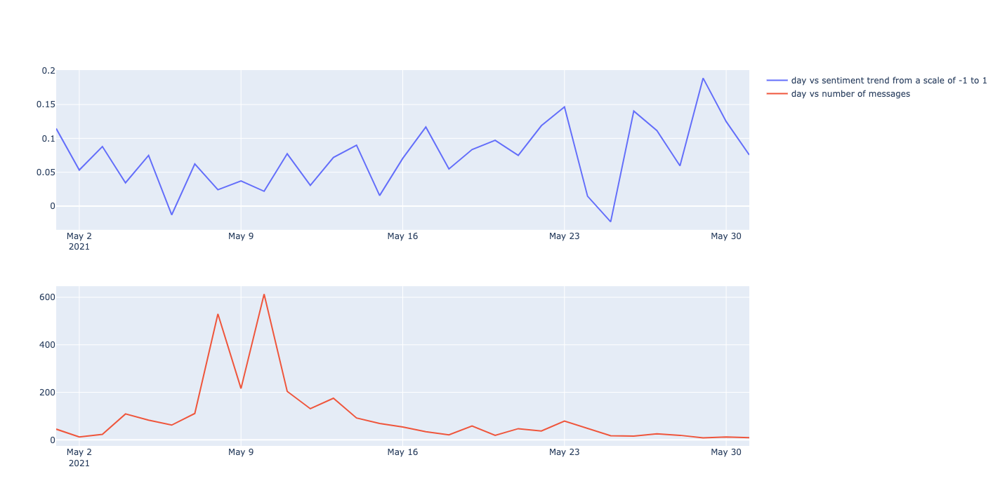
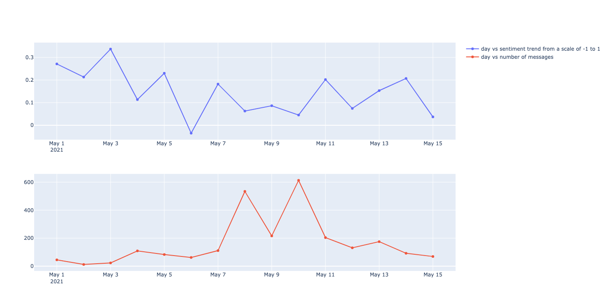

# sentiment-analysis
## Code structure

The package is developed on Python 3.8.9 environment and uses APIs and methods that are compatible with Python 3.7+ interpreters.

### Source files

    .
    ├── output                  # screenshots of results
    ├── src                     # Source files
    │   ├── data                # JSON files after exporting from telegram
    │   └── analyzer.py         # main executable python file
    ├── requirements.txt        
    ├── LICENSE
    └── README.md 

* `data` folder contains two JSON files `data.json` and `data_may.json`. data.json contains the telegram chats from May 1st to May 15th. data_may.json contains telegram chats for the entire month of may. This was done so that I could verify if the code was extensible to any timeframe and any JSON file.

* `analyzer.py` takes in a certain set of options (check out [How to run](#how-to-run)) and generates a line graph to show the average sentiment on a daily basis and the number of messages that contain any mention of **SHIB** or **DOGE**.

* I have used the NLTK Vader Lexicon Sentiment Intensity Analyzer to compute the sentiment of each text message. I also saw `FLAIR` but liked the APIs that Vader provided, so I decided to move forward with Vader.

### Dependent packages

* nltk
* tqdm
* plotly==5.4.0

<a name="how-to-run"></a>
## How to run

- Enable Python virtual Environment

      source bin/activate

- Install dependencies

      pip3 install -r requirements.txt

  or
      pip install -r requirements.txt

- Go to src folder

      cd src

- Run the below command to generate the sentiment graph

      python3 analyzer.py
  If `python --version` > 3, then the below command would also suffice

      python analyzer.py

### options

- When no options are passed it parses `data.json` file in data folder (telegram chats between may 1st to may 15th).
- to print the average sentiment values in the console, you can use the `--trace` option as shown below:

    python3 analyzer.py --trace

- to specify a particular file use the --file option with the fileName as the last argument to the script, eg: `data_may.json` (telegram chats for the entire month of may 2021) under the data folder

    python3 analyzer.py --file ./data/data_may.json

- A combination of both `--trace` and `--file` can be seen below:

    python3 analyzer.py --trace --file ./data/data_may.json

- To exclude all messages with neutral sentiment from the average pass the `--exclude-neutral` option

    python3 analyzer.py --exclude-neutral
## Observations

- Many telegram chats have neutral sentiments and I have considered these in the average sentiment. I have calculated the average sentiment using the below formula

```
average = sum(compound polarity score)/number of messages
```
I am summing up the compound polarity score from the NLTK Vader model.

- methods `analyze` and `analyzeWithoutNeutral` are executed to get the average sentiment distribution.

* Following is the plot of day vs average sentiment and number of messages over the period of May 1st to May 15th

<br /><center><br />


* The following are the data cleaning and preprocessing cases handled:
  * Filter out all messages that do not have `shib` and `doge` in any portion of the string.
  
  * Some messages are lists as they have links and other components excluding the tests. For these messages, I have checked if any one of the component have `shib` or `doge`.
  
  * method `checkIfContainsX` handles the filtering of the above keywords.
  
  * many messages have emojis and since emojis can also contribute to the sentiment of the message we need to include them in the processing. I have observed that NLTK Vader does not account the emojis for the analysis. Hence I am using `demoji` package to convert the emoji to its appropriate text description.
  
  * All messages with non-ASCII text is not being considered.

* I have also tried to execute the same script to chats spanning for the entire month of May to check if it corroborates with the trend specified [here](https://en.ethereumworldnews.com/shiba-inus-shib-social-sentiment-drops-to-bearish-territory/). The output is seen below

<br /><center><br />

* NLTK Vader would not be able to recognize text messages in hindi transliterated to english. I could observe a lot of such english messages whose sentiment would be positive/negative in hindi. One additional data processing step could be to try to translate the text to english. I have not developed this step as I am wary if the translations would be accurate.

* the sentiment analysis if we were to exclude all neutral messages are as shown below:

<br /><center><br />